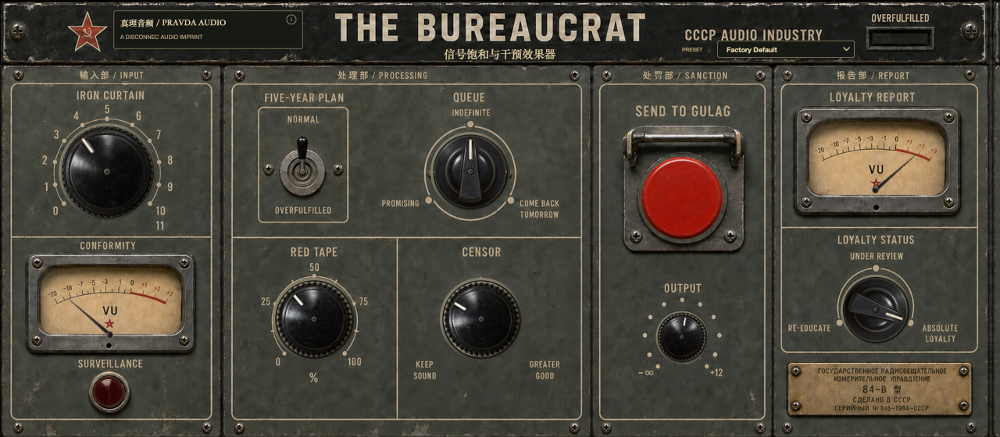

# THE BUREAUCRAT

THE BUREAUCRAT is an open-source saturation and intervention audio effect from
**真理音频 / Pravda Audio**, an imprint of **Disconnec audio**. It combines
asymmetric drive, timing disruption, phase interference, filtering, overload
control, and a long feedback delay in a compact hardware-inspired panel.

The plug-in has no account, activation, telemetry, analytics, or network access.
Audio is processed locally in the host.



## Formats

- AU on macOS
- VST3 on macOS
- Standalone development application
- macOS 11 or newer
- Apple Silicon and 64-bit Intel builds

The current verified release target is macOS. Other platforms are welcome, but
are not yet part of the supported test matrix.

## Controls

- **Iron Curtain** controls input drive and asymmetric saturation.
- **Five-Year Plan** enables additional digital degradation.
- **Queue** selects one of three timing-disruption behaviors.
- **Red Tape** blends delayed phase interference into the signal.
- **Censor** removes high-frequency detail with a low-pass filter.
- **Send to Gulag** routes the signal into a long stereo feedback delay.
- **Output** adjusts the final level.
- **Loyalty Status** selects three levels of audible band restriction.

The Conformity meter follows input activity. Excess input, high Iron Curtain
settings, or Five-Year Plan mode activate Surveillance and narrow the signal's
frequency range.

## Factory Presets

Eleven factory presets are available from both the host and the plug-in's top
bar: Factory Default, Approved Broadcast, Iron Quota, Breadline Shuffle, Red
Tape Chamber, Censored Radio, Five-Year Collapse, Surveillance State, Siberian
Exile, Absolute Loyalty, and Dissident Underground.

Preset selection and all parameter values are stored with the host project.
Every parameter remains automatable after a preset is loaded.

## Build

Requirements:

- CMake 3.22 or newer
- Xcode command-line tools on macOS
- An internet connection for the first configure

The default build fetches the pinned JUCE 8.0.11 release automatically:

```sh
cmake -S . -B build -DCMAKE_BUILD_TYPE=Debug -DBUILD_TESTING=ON
cmake --build build --parallel 6
ctest --test-dir build --output-on-failure
```

For an offline or locally patched JUCE checkout, provide its path explicitly:

```sh
cmake -S . -B build -DJUCE_DIR=/path/to/JUCE -DBUILD_TESTING=ON
```

Build artefacts are written under `build/TheBureaucrat_artefacts`. Debug builds
do not copy plug-ins into system folders automatically.

## Project Structure

- `Source/` contains the plug-in, editor, parameters, and DSP engine.
- `UI/v3/runtime/` contains the image assets embedded in the plug-in.
- `Docs/Images/` contains documentation captures derived from the runtime UI.
- `Tests/` contains DSP, UI render, repository, and host smoke tests.
- `LICENSES/` contains third-party and asset licence texts.

## Contributing

Read `CONTRIBUTING.md` before opening a pull request. Security reports should
follow `SECURITY.md` instead of being posted publicly.

## Licence

Project source code is licensed under the GNU Affero General Public License
version 3. See `LICENSE`.

Original runtime artwork is available under CC BY-SA 4.0 to the extent that
copyright or related rights subsist. See `ASSETS_LICENSE.md`. Brand names,
wordmarks, and logos are not licensed as trademarks; see `TRADEMARKS.md`.

Third-party components remain under their own terms, documented in
`THIRD_PARTY_NOTICES.md` and `LICENSES/`.

Copyright 2026 Disconnec audio / Pravda Audio.
